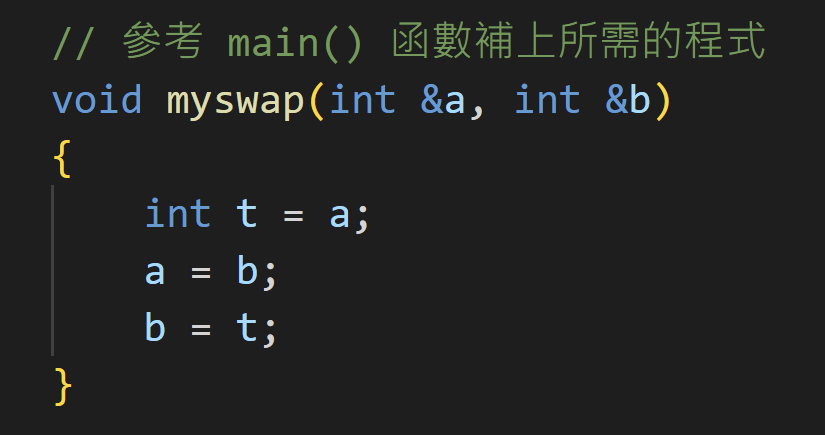

## 使用『傳遞參考』(Pass by Reference)參數傳遞方式設計函數。

- 設計 `swap(...)` 函數對調給定的兩個參數內容。
- 參數(parameters)的傳遞方式務必使用『傳遞參考』`(Pass by Reference)`。

### 參考答案



### 在 Windows 使用自動批閱測試
```shell
lab01> .\test.ps1
g++ -o main ./main.cpp

********************************************
*       Introduction to Programming        *
*  Exercises / Homework Automatic Grading  *
********************************************

Test Data :    87    8
Test Data :     6   42
Test Data :    39   70
Test Data :    60   62
Test Data :    22   32
Test Data :    48   49
Test Data :     9   41
Test Data :    15   45
Test Data :    15   18
Test Data :    68   81

測試通過!

   68   81
   81   68
```

