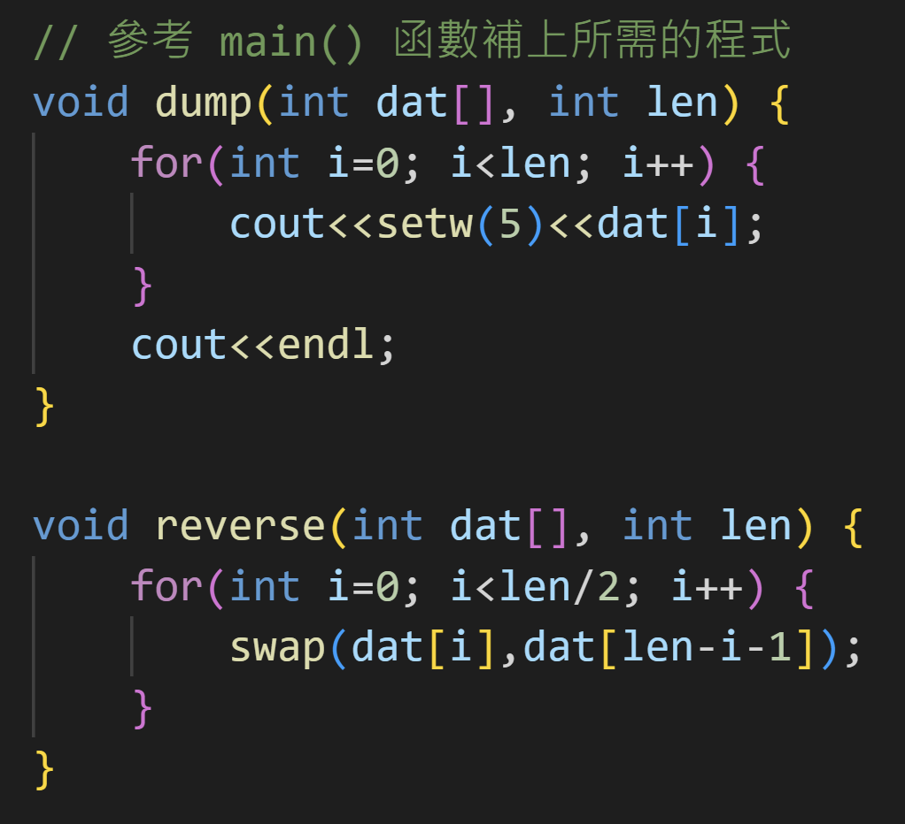

## 反轉一維陣列內容。

- 將一維陣列反轉(reverse)並輸出所有內容。
- 資料輸出至少要有一個空格作為間隔。
- 建議的函數原型：
```C++
void reverse(int arr[], int len);
```
    - arr 參數指向一維陣列
    - len 給定的陣列長度

### 參考答案



### 在 Windows 使用自動批閱測試
```shell
lab03> .\test.ps1
g++ -o main ./main.cpp

********************************************
*       Introduction to Programming        *
*  Exercises / Homework Automatic Grading  *
********************************************

[77, 11, 3, 80, 13, 46, 53, 17, 18, 75, 41, 71, 89, 6, 4]
[80, 32, 37, 94, 44, 1, 94, 39, 91, 35, 45, 99]
[59, 100, 49, 66, 47, 64, 73, 29, 28, 70, 17, 84]
[36, 38, 97, 53, 17, 73, 78, 69, 35, 6]
[61, 58, 98, 17, 14, 83, 75, 65, 74]
[98, 41, 20, 48, 37, 64, 91, 24, 8, 17, 48, 14, 25, 84, 97]
[39, 46, 46, 59, 30]
[74, 99, 55, 2, 71, 29, 60, 94, 73, 83, 48, 68, 74, 79]
[14, 2, 83, 92, 23, 54, 24, 97, 71, 47]
[6, 53, 12, 59, 50]

測試通過!

   50   59   12   53    6
```

