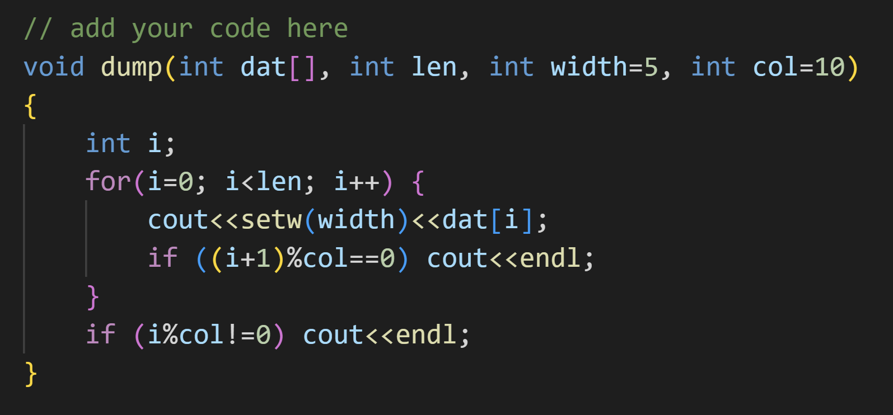

## 一維陣列應用：依指定資料寬度及每一行(row)的列數(col)輸出陣列。

- 每一行(row)輸出最多 `c` 筆資料，每一列(col)的寬度 `w` 個字元。
- 內定參數：每一行最多 `10` 筆資料，沒列的寬度為 `5` 個字元。
- 建議函數原型如下：
``` C++
void dump(int dat[], int len, ...)
```
- 其他參數請參閱主程式 main() 的使用，提供適當的參數定義。

### 參考答案



### 在 Windows 使用自動批閱測試
```shell
lab04> .\test.ps1
g++ -o main ./main.cpp

********************************************
*       Introduction to Programming        *
*  Exercises / Homework Automatic Grading  *
********************************************

Test Data : [7, 42, 10, 50, 37, 5, 96, 87, 85, 96, 15, 13, 45, 75, 96, 18, 34]
Test Data : [53, 66, 27, 71, 2, 91, 23, 68, 7, 9, 25, 54, 70, 17, 51, 62]
Test Data : [4, 96, 24, 87, 13, 2, 20, 82, 47, 93, 82, 28, 33, 14, 29]
Test Data : [64, 63, 53, 71, 66, 68, 81, 14, 13, 15, 97, 28, 97, 6, 65]
Test Data : [27, 9, 68, 11, 1, 7, 24, 65, 38, 14, 20, 23, 61, 85, 41, 33]
Test Data : [74, 62, 69, 27, 2, 10, 1, 21, 94, 81, 69, 81, 21, 25, 23, 4, 23, 60, 38]
Test Data : [6, 68, 71, 80, 4, 95, 86, 59, 37, 3, 23, 1, 86, 47, 12, 98]
Test Data : [30, 33, 95, 58, 31, 37, 100, 17, 8, 20]
Test Data : [74, 31, 48, 37, 71, 77, 89, 83, 66, 93]
Test Data : [25, 18, 25, 65, 84, 87, 25, 80, 62, 99, 30]

測試通過!

   25   18   25   65   84   87   25   80   62   99
   30

 25 18 25 65 84 87 25 80 62 99
 30

        25        18        25
        65        84        87
        25        80        62
        99        30
```