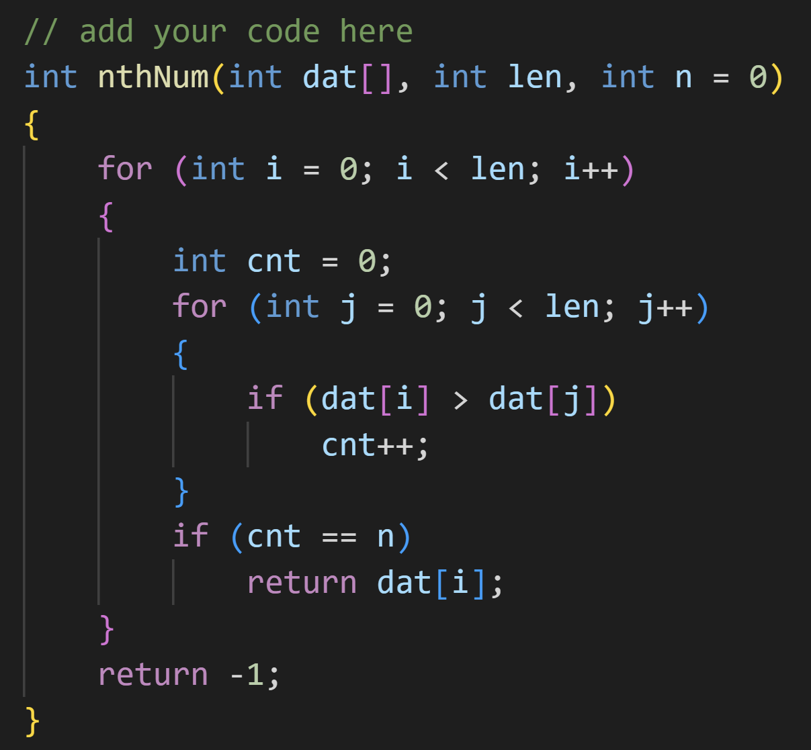

## 一維陣列的應用：輸出陣列中排第 `n` 『順位』的整數。

- 解題方式『不可』先將陣列排序。
- 建議函數原型：
```C++
int nthNum(int dat[], int len, ...);
```
- 其他參數請參閱主程式 main() 的使用，提供適當的參數定義。

### 參考答案



### 在 Windows 使用自動批閱測試
```shell
lab05> .\test.ps1
g++ -o main ./main.cpp

********************************************
*       Introduction to Programming        *
*  Exercises / Homework Automatic Grading  *
********************************************

Test Data : 5 20 23 26 43 50 66 67 72 73 74 75 79 84 86 93 96 98 100
            [5, 20, 23, 26, 43, 50, 66, 67, 72, 73, 74, 75, 79, 84, 86, 93, 96, 98, 100]
Test Data : 64 99 68 5 40 41 45 77 79 20 52 86 92 63
            [5, 20, 40, 41, 45, 52, 63, 64, 68, 77, 79, 86, 92, 99]
Test Data : 64 4 10 91 43 75 16 17 50 89 27
            [4, 10, 16, 17, 27, 43, 50, 64, 75, 89, 91]
Test Data : 96 65 7 18 52 22 55 25 59 60 29
            [7, 18, 22, 25, 29, 52, 55, 59, 60, 65, 96]
Test Data : 1 2 35 100 67 36 9 10 51 24 57 28 61
            [1, 2, 9, 10, 24, 28, 35, 36, 51, 57, 61, 67, 100]
Test Data : 96 65 35 6 70 72 7 43 44 12 81 49 19 58 61 30 63
            [6, 7, 12, 19, 30, 35, 43, 44, 49, 58, 61, 63, 65, 70, 72, 81, 96]
Test Data : 69 40 14 17 83 84 85 54 95 31
            [14, 17, 31, 40, 54, 69, 83, 84, 85, 95]
Test Data : 64 65 34 3 4 67 9 46 81 51 84 19 87 56 90 60 95
            [3, 4, 9, 19, 34, 46, 51, 56, 60, 64, 65, 67, 81, 84, 87, 90, 95]
Test Data : 96 2 5 38 12 14 51 52 20 86 87 57 90 59
            [2, 5, 12, 14, 20, 38, 51, 52, 57, 59, 86, 87, 90, 96]
Test Data : 4 5 71 7 77 14 15 18 87 55 57 90 31 61 95
            [4, 5, 7, 14, 15, 18, 31, 55, 57, 61, 71, 77, 87, 90, 95]

測試通過!

4
5
18
55
95
````